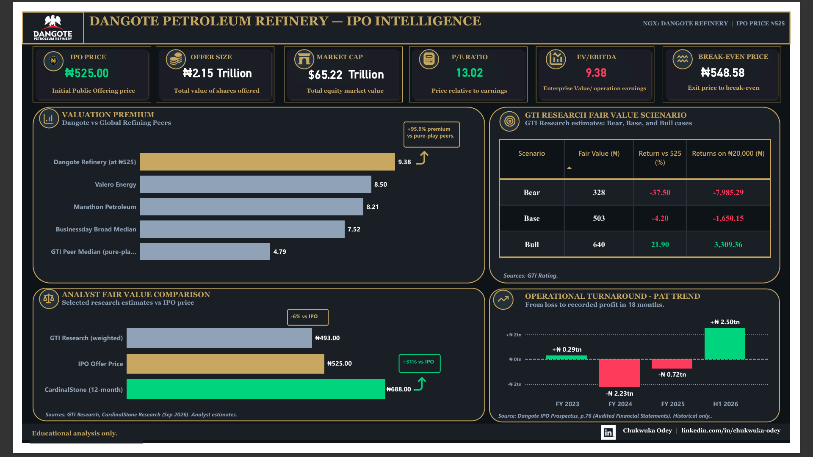
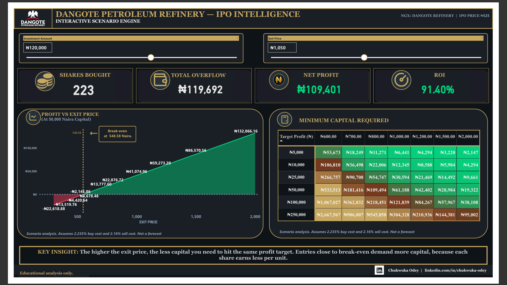

# Dangote Refinery IPO Intelligence Dashboard

A data-driven investor analysis of the Dangote Petroleum Refinery & Petrochemicals FZE Initial Public Offering at ₦525 per share.

## Overview

This project analyses the Dangote Refinery IPO — Nigeria's largest ever — through a combination of audited financial data, peer valuation benchmarks, published analyst research, and interactive scenario modelling.

The output is a two-page interactive Power BI dashboard and a 12-slide investor briefing deck. It is designed to inform, not advise. Every number is sourced. Every assumption is documented.

## The Central Insight

The refinery swung from a ₦2.23tn loss (FY 2024) to a ₦2.50tn profit (H1 2026). Yet at ₦525, Dangote trades at a 95.9% premium to pure-play refining peers.

GTI Research calls the offer fully valued (weighted fair value ₦493).
CardinalStone Research sees +31% upside (12-month target ₦688).

Two credible views. One decision — yours.

## Dashboard Preview

### Page 1 — Executive Snapshot & Valuation

### Page 2 — Interactive Scenario Engine

## Key Findings

| Metric | Value | Source |
|---|---|---|
| IPO Price | ₦525.00 | Prospectus p.1 |
| Offer Size | ₦2.15tn ($1.50bn) | Prospectus p.34 |
| Market Cap (post-offer) | ₦65.22tn | Calculated |
| P/E (post-offer) | 13.02x | Calculated |
| EV/EBITDA (post-offer) | 9.38x | Calculated |
| GTI Peer Median EV/EBITDA | 4.79x | GTI Research |
| Premium vs Peers | +95.9% | Calculated |
| Break-Even Exit Price | ₦548.58 | Calculated |
| Required Move to Break Even | +4.49% | Calculated |
| H1 2026 PAT | ₦2.50tn | Prospectus p.76 |
| H1 2026 Revenue | ₦19.13tn | Prospectus p.76 |

## Project Structure

- `data/` — Raw extraction from the IPO prospectus and processed analysis outputs
- `scripts/` — Python analytical engine (valuation, scenario matrix, minimum investment calculator)
- `powerbi/` — Interactive two-page Power BI dashboard
- `presentation/` — 12-slide investor briefing
- `screenshots/` — Dashboard and deck preview images
- `documentation/` — Data dictionary, methodology, assumptions, sources

## Methodology

### Valuation
- P/E = IPO price ÷ annualised EPS
- EV/EBITDA = (Market cap + Net debt) ÷ annualised EBITDA
- P/S = Market cap ÷ annualised revenue

### Scenario Modelling
- Investment capital is total outflow (costs deducted from capital)
- NGX round-trip costs: 2.235% buy + 2.16% sell = 4.395%
- Break-even = IPO price × (1 + buy cost) ÷ (1 − sell cost)

### Annualisation
H1 2026 figures are doubled as a conservative estimate.

## Assumptions

| Assumption | Value |
|---|---|
| FX Rate | ₦1,380.59/$ |
| Buy Cost Rate | 2.235% |
| Sell Cost Rate | 2.16% |
| Holding Period | 12 months from listing |
| Dividends | Excluded; 10% WHT if paid |
| Peer Multiples | GTI Research & Businessday |

Full details in `documentation/assumptions.md`.

## Data Sources

1. Dangote Petroleum Refinery & Petrochemicals FZE — IPO Prospectus, 7 September 2026
2. GTI Research — Initiation of Coverage, September 2026
3. CardinalStone Research — Initiation of Coverage, September 2026
4. Businessday — Peer comparison analysis, September 2026
5. Nigerian Exchange Limited — Transaction cost schedule

Full list in `documentation/sources.md`.

## Tools Used

| Tool | Purpose |
|---|---|
| Python (Pandas, NumPy) | Data cleaning, valuation, scenario generation |
| Excel | Data extraction, validation |
| Power BI + DAX | Interactive dashboard |
| PowerPoint | Investor briefing deck |

## How to Reproduce

1. Clone the repository:
   git clone https://github.com/chuks007-data/Dangote-Refinery-IPO-Intelligence.git

2. Install Python dependencies:
   pip install pandas numpy openpyxl

3. Run the analytical engine:
   python scripts/dangote_ipo_engine.py

4. Open `powerbi/Dangote_IPO_Intelligence.pbix` in Power BI Desktop.

## Author

Chukwuka Odey
- LinkedIn: linkedin.com/in/chukwuka-odey
- Email: chukwukaodey@gmail.com

## Disclaimer

This project is for educational and informational purposes only. It does not constitute investment advice, a recommendation, or an offer to buy or sell any security. All scenarios are illustrative and based on stated assumptions. Past performance and projected figures are not guarantees of future results. Investors should consult a qualified financial advisor before making any investment decisions.

## License

This project is licensed under the MIT License — see LICENSE for details.